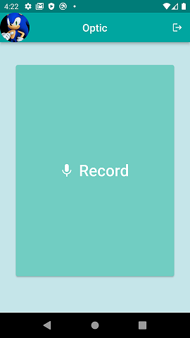

# Optic

## ABOUT
Optic is a personal assistant app made specifically for blind people. It is easy to use and helps the blind 'see' their surroundings using a phone's camera and computer vision technology. Using the current version of our app, blind people can read books and signs, and can also search the web for any information they would like.

## LANGUAGES
The app and its functionalities are coded entirely in dart using the [Flutter](https://flutter.dev/) framework.

## INSTALLATION
The app can be installed on any Android device. It will be available on the play store soon.

## FEATURES
'Taking a picture' - takes a picture using the phone's camera at that instant and proceeds to read information back to the user.
'Searching for information' - searches up detailed yet brief information that the user asks about and recites it back.

## USAGE
To have the app read your surroundings out to you, simply point the phone in the general direction of the text, click the large button to activate the assistant, and say 'take a picture'. Within a few seconds, Optic will be reading out whatever is in front of you.
To search for information on the web that would normally involve looking at a screen with tiny letters, you can instead click the large button, say 'search for XXXX', and Optic will read out information regarding XXXX to you.

## UI
The UI is extremely simple. With the help of a trusted member, a blind person can log into Optic using his google account. From there, Optic will remember him to be linked to that device until he decides to sign out. Once the account is set up, the blind person is completely independent. There is only a single large button that can easily be pressed to activate the assistant, after which commands can be spoken by the user. pressing the button activates the listener, so privacy is maintained when not speaking to the app.

## ADDITIONAL FEATURES
the core component of Optic (the surrounding reader) works completely locally and does not require an internet connection which allows blind people to be independent even without a stable connection.
